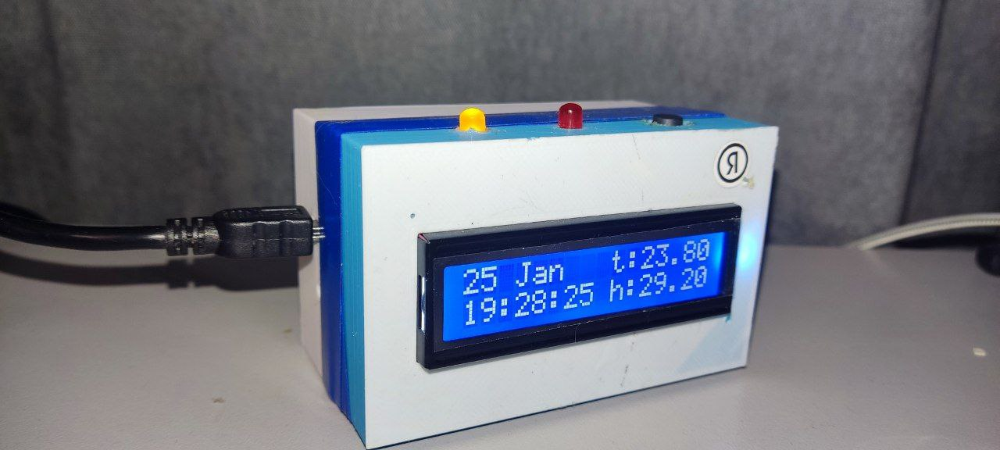
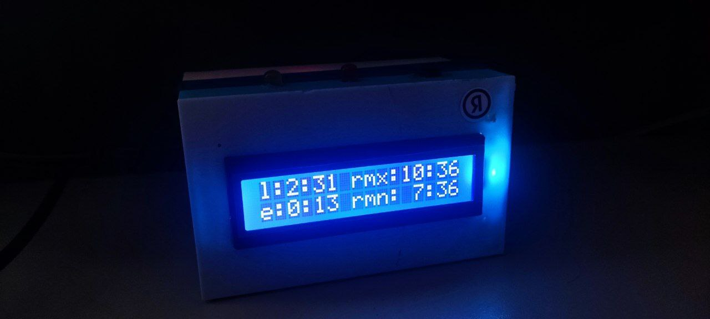
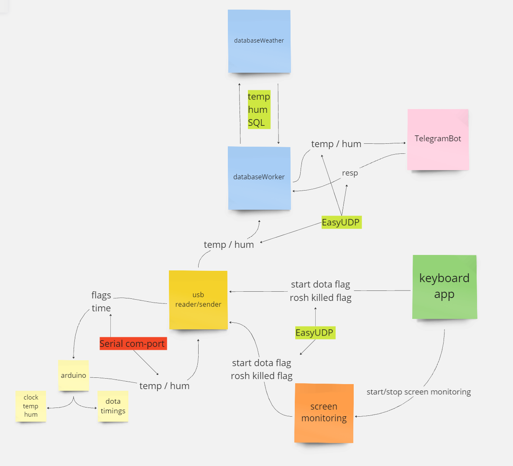

# dota2Arduino_HomeAssistan
\
A set of programs in C/Python that allows easy monitoring of respawn timings for Roshan/Lotuses/Wisdom Runes.
+ The installation itself serves as a clock with the current date, also displaying the current room humidity and temperature on the screen.
+ Temperature and humidity readings can be tracked through a Telegram bot, with the ability to create graphs for different time intervals and view current readings.
  

## Description of Operation and System Preparation

### Installation
Simply run `pip install -e .` and all necessary dependencies will be installed.
### Arduino
In essence, you can assemble a separate device based on Arduino Nano to track timings, but pressing the device button during the game is not very convenient.

Assembly is done according to the following scheme.
The resistors on the diodes have a nominal value of ~500 Ohms, and the pull-up for the button is 10k Ohms.

### Arduino Control
- A double click on the start button initiates the game timer, displaying a three-minute countdown on the screen, showing Lotus timings. Also, 15 seconds before Lotus spawns, the LED starts blinking, and if sound is enabled, the buzzer plays a melody when there are 10 seconds left on the timer.
- A single click on the button signals that Roshan has died, initiating two timers: for 11 and 8 minutes respectively. The rest is similar to the first point.
- Holding the button will toggle the flag responsible for sound playback. The lit LED indicates whether the sound is on or off.

### PC Control
To control from a PC, the board must be powered via your computer's USB !
You can run it as a regular Python script with `main.py` or create an exe file for ease of use.

To create an exe file, simply run `pyinstaller --onefile --noconsole .\main.py`\
I do not guarantee the functionality of this method; it has not been tested.\
In the dist directory, you'll find the executable file that can be easily launched with a double click.

- Pressing F6 starts the game and Lotus timers.
- Pressing F7 notifies Arduino that Roshan has died.
- Pressing F8 toggles the flag responsible for sound playback (sound plays 15 seconds before any of the timings)\
  \

### Automatic Control

During script execution, certain areas of the screen are scanned. Therefore, the game start flag may switch when the in-game clock reaches 00:00\
Similarly, there is a check for whether Roshan is alive or not; the flag switches automatically upon Roshan's death \
When the game ends, press F6/two clicks on the Arduino button; there is no automatic detection of the end of the game 

#### Running on Windows

For Windows users, simply replace the paths in the `run.bat` file and create a shortcut in the startup/desktop

## Additional Information

In the data folder, there is an icon for the application, and a model of the case for printing.

## Project scheme
