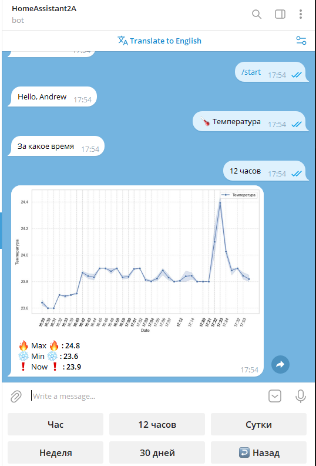
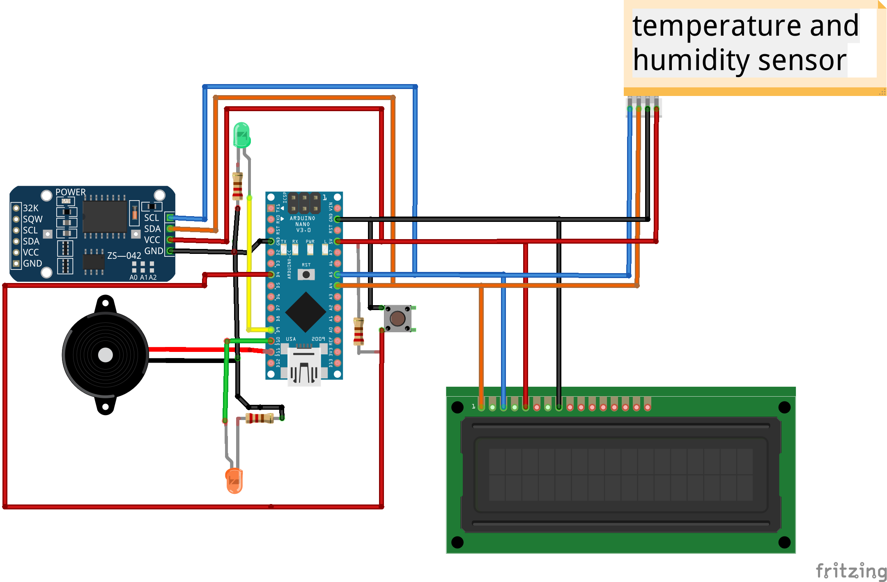

# dota2Arduino_HomeAssistan
Набор программ на C / Python, позволяющий легко контролировать тайминги респавна рошана / лотусов / рун экспы
+ сама установка сама по себе выполняет роль часов с текущей датой, также на экране отображает текущая влажность и температура в комнате
+ показатели температуры и влажности можно отслеживать с помощью телеграмм бота, есть возможность как строить графики за разные промежутки времени, так и смотреть просто текущие показатели

## описание работы и подготовка системы
### Установка
Достаточно запустить `pip install -e .` все нужные зависимости будут установлены
### Arduino
По сути можно собрать отдельное устройство на базе Arduino nano с помощью которого можно отслеживать тайминги, но это не очень удобно, ибо тыкать на кнопку устройства во время игры не совсем удобно

Сборка производится по следующей схеме
Резисторы на диодах имеют номинал в ~500 Ом, подтяжка для кнопки - 10КОм

### Управление на Arduino
- 2 клика по кнопке запускает таймер игры, на экран выводится трехминутный отсчет, показывающий тайминги лотусов, также, за 15 секунд до лотуса начинает мигать светодиод, если включен звук - пищалка проиграет мелодию, когда на таймере останется 10 секунд
- 1 клик по кнопке сигнализирует о том, что рошан умер, запускается два таймера: на 11 минут и 8 минут соответсвенно, остальное аналогично первому пункту 
- удержание кнопки переключит флаг, отвечающий за воспроизведение звука, по горящему диоду можно определить включен звук или нет

### Управление с ПК 
! Для управления с пк нужно, чтобы плата питалась через USB вашего компьютера !\
Можно запусть как обычный питоновский скрипт `main.py`, так и создать exe-файл, которым мы будем пользоваться

Для создания exe-файла достаточно выполнить `pyinstaller --onefile --noconsole .\main.py`

В директории dist будет лежать исполняемый файл, который спокойно запускается при даблклике 

- При нажатии F6 запускается таймер старта игры и лотусов соответсвенно
- При нажатии F7 оповестим ардуинку, что рошан умер
- При нажатии F2 переключится флаг, отвечающий за воспроизведение звуков (звук воспроизводится за 15 секунд до наступления любого из таймингов)\
За работоспособность данного метода не отвечаю, не тестировал 

### Автоматическое управление 
Во время работы скрипта идет сканирование определенных областей экрана, поэтому флаг старта игры может переключиться тогда, когда на часах в доте будет 00:00\
Таким же образом идет проверка на то - жив рошан или нет, при убийстве рошана флаг также переключится автоматом \
При завершении игры следует нажать F6 / два раза на кнопку ардуины, автоматического определения конца игры нет 

#### Запуск на Windows
Для пользователей windows достаточно заменить пути в файле `run.bat` + сделать ярлык в автозапуске/рабочем столе 

## дополнительно
В папке data есть иконка для приложения + модель корпуса для печати 
